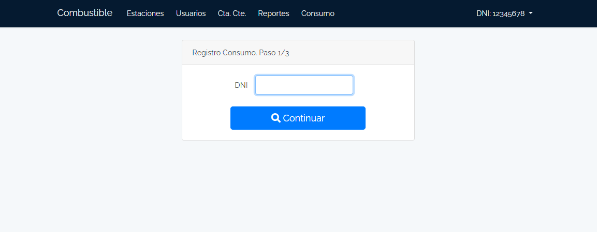

# Combustible 
## Aplicación para gestión de cuentas de combustible
  
Hecha originalmente para un municipio de la provincia de Buenos Aires, Argentina. 

Los usuarios son cuentas con saldos y pueden realizar transacciones de ingresos y egresos.

Hay cuatro tipos de usuarios:

* El administrador crea las cuentas y las asigna a los usuarios.
* Los expendedores pueden ingresar consumos.
* Los visores de cuentas pueden ver las cuentas y realizar transacciones de ingresos y egresos.
* Los usuarios son consumidores que cargan combustible utilizando el saldo de sus cuentas pricipales.

Hay dos tipos de cuentas: Principal y Secundaria. 

* Las principales son las que se utilizan para realizar las transacciones de ingresos y egresos.

* Las secundarias son las que se utilizan en la gestión de los consumos.

El objetivo de este proyecto es gestionar los consumos de combustible de manera eficiente y transparente. Donde las cuenta principales son sectores del municipio y las secundarias son las que se utilizan en la gestión de los consumos.

La validación de los consumos se da al intervenir el usuario Expendedor y acredita el consumo.

De esta manera se puede trazar el consumo de combustible y controlar la gestión de los consumos y cuentas.

## Tecnologías utilizadas:
* Laravel 
* Bootstrap 4
* DataTables
* Maatwebsite/excel
* PWA 

*Elementos de laravel avanzados*
- Middleware
- Seeders
- Factories

### *__Migración__*

Originalmente el proyecto fue hecho con Laravel 5.x, pero al momento de compartirlo decidí migrar a Laravel 10.x. con lo cual hay elementos que pueden tener código obsoleto y otros como el caso de algunos reportes de Excel que directamente no los actualize.

### Lo comparto
Con el objetivo de ser parte de mi porfolio y que pueda ser utilizado por otros.
Con un poco de cambios puede servir como base para otros proyectos donde se manejen cuentas con saldos y transacciones de ingresos y egresos.

 
 

